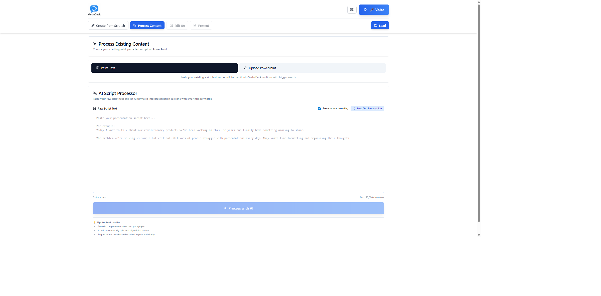
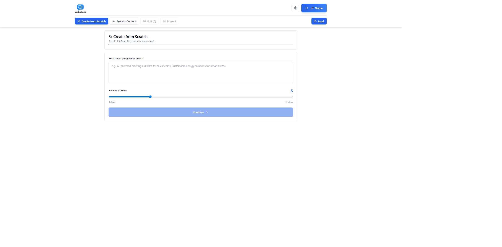

# 🎤 VerbaDeck

**Voice-Driven Presentations with AI-Powered Intelligence**

> Transform how you present. Speak naturally, advance automatically. No clicker needed.

<div align="center">

[](https://opensource.org/licenses/MIT)
[](https://react.dev/)
[](https://nodejs.org/)

</div>

---

## 🌟 What is VerbaDeck?

VerbaDeck is a revolutionary presentation platform that lets you deliver presentations **completely hands-free** using voice commands. Simply speak naturally, and VerbaDeck automatically advances your slides when you say trigger words. Perfect for product demos, sales pitches, conference talks, and any presentation where you need your hands free.

**Built by [Machine King Labs](https://machinekingdomlabs.com)** - Innovation in AI-powered presentation technology.



---

## ✨ Key Features

### 🗣️ Advanced Voice Control
- **Intelligent Trigger Detection**: AI identifies natural trigger words that advance slides
- **Multi-Trigger Support**: Multiple trigger words per slide for flexibility
- **Plural Recognition**: Automatically detects plurals (e.g., "solution" matches "solutions")
- **BACK Command**: Navigate backwards with "back", "previous", or "go back"
- **2-Second Debounce**: Prevents accidental double-advances from transcript echoes
- **Real-Time Transcription**: Powered by AssemblyAI's streaming API

### 🤖 AI-Powered Intelligence
- **Operation-Specific Model Defaults**:
  - GPT-4o Mini for fast, cost-effective operations (20x cheaper!)
  - Claude 3.5 Sonnet for premium quality tasks
- **50+ AI Models**: Choose from GPT-4, Claude, Gemini, Llama, and more via OpenRouter
- **Smart Script Processing**: Transform raw text into structured sections
- **Preservation Mode**: Keep exact wording for legal/medical/enterprise content
- **AI Trigger Suggestions**: Get intelligent trigger word recommendations
- **Model Override**: Users can always override defaults via UI

### 🎓 Live Q&A System
- **Question Detection**: Automatically detects "?" in transcripts when Q&A mode is ON
- **Dual AI Answers**: Generates TWO complete answer perspectives
- **8 Personality Tones**:
  - 💼 Professional - Clear and authoritative
  - ✨ Witty & Engaging - Clever and memorable
  - 🧠 Deeply Insightful - Analytical and nuanced
  - 💬 Conversational - Warm and relatable
  - 🔥 Bold & Provocative - Challenges assumptions
  - 🔬 Technical Expert - Precise and data-driven
  - 📖 Storytelling - Compelling narratives
  - 😏 Sarcastic & Sharp - Dry wit
- **Knowledge Base**: AI-powered FAQ generation + manual entry
- **Context-Aware**: Uses presentation content + knowledge base for accurate responses
- **Easy Toggle**: "Q&A" button in status bar (green when active)

### 🎨 Presentation Features
- **Create from Scratch**: AI-guided presentation builder with topic-based generation
- **Process Existing Content**: Convert scripts or PowerPoint files
- **Rich Text Editor**: Bold, italic, headings, bullets with Tiptap
- **Image Support**: Add visuals to slides
- **Dual-Monitor Mode**: Presenter view with controls + clean audience view
- **BroadcastChannel Sync**: Real-time window synchronization
- **Smooth Transitions**: Framer Motion animations
- **Progress Tracking**: Visual progress bar and section counter
- **Trigger Carousel**: Shows previous, current, and next trigger words

### 💾 Save & Load
- **File Export/Import**: Save as `.verbadeck` files
- **LocalStorage**: Auto-save presentations in browser
- **Quick Load**: One-click test presentation loading
- **Cross-Device**: Load presentations on any device

### 📱 Modern Web App
- **Progressive Web App**: Install on mobile/tablet/desktop
- **Offline Mode**: Works without internet after initial load
- **Responsive Design**: Optimized for all screen sizes
- **Mobile-First UI**: Portrait and landscape support

---

## 🎯 Use Cases

### 🚀 Product Demos & Sales Pitches
**Perfect for**: Software demos, product launches, sales presentations

**Why VerbaDeck**: Keep your hands free to operate your product while advancing slides naturally. No fumbling with a clicker when you need to demonstrate features.

**Example**: Demo a mobile app while advancing through feature slides by saying "dashboard", "analytics", "reporting" as trigger words.

---

### 🎤 Conference Talks & Keynotes
**Perfect for**: Tech conferences, TEDx talks, academic presentations

**Why VerbaDeck**: Maintain natural body language and eye contact with your audience. No distractions from clickers or keyboard shortcuts.

**Example**: Deliver a keynote about AI ethics with hands-free navigation, using Q&A mode to handle audience questions with AI-generated talking points.

---

### 📊 Executive Briefings & Board Meetings
**Perfect for**: Quarterly reviews, strategy presentations, investor pitches

**Why VerbaDeck**: Professional dual-monitor setup with preservation mode for exact wording. AI-powered Q&A ensures accurate responses.

**Example**: Present quarterly financials with "revenue", "growth", "forecast" as triggers, with Q&A mode providing professional-toned answers to board questions.

---

### 🏥 Medical & Healthcare Presentations
**Perfect for**: Grand rounds, medical conferences, patient education

**Why VerbaDeck**: Preservation mode keeps medical terminology exact. Hands-free for gestures and demonstrations.

**Example**: Present treatment protocols with clinical terms as triggers, maintaining precise medical language.

---

### 🎓 Academic Lectures & Training
**Perfect for**: University lectures, corporate training, workshops

**Why VerbaDeck**: Engage students with natural presentation flow. Use Q&A knowledge base for common student questions.

**Example**: Teach machine learning concepts with "supervised", "neural", "training" as triggers, generating insightful answers for student questions.

---

### 💼 Internal Team Presentations
**Perfect for**: Sprint reviews, project updates, team meetings

**Why VerbaDeck**: Conversational tone options and quick setup. Save/load presentations for recurring meetings.

**Example**: Weekly sprint review with "completed", "progress", "blockers" as triggers, using conversational Q&A tone.

---

## 🚀 Quick Start

### Prerequisites
- **Node.js** 18+ and npm
- **AssemblyAI API Key**: [Get free key](https://www.assemblyai.com/) (100 hours/month free)
- **OpenRouter API Key**: [Get key](https://openrouter.ai/) for AI models
- **Browser**: Chrome, Edge, or Chromium-based (for Web Audio API)
- **Microphone**: Required for voice input

### Installation

```bash
# Clone the repository
git clone https://github.com/taskmasterpeace/verbadeck.git
cd verbadeck

# Install dependencies (root, server, and client)
npm install
cd server && npm install && cd ..
cd client && npm install && cd ..
```

### Configuration

Create `.env` in the project root:

```env
AAI_API_KEY=your_assemblyai_api_key_here
OPENROUTER_API_KEY=your_openrouter_api_key_here
```

🔒 **Security**: Never commit `.env` - it's already in `.gitignore`

### Run Development

```bash
# From project root - starts both server and client
npm run dev
```

This launches:
- **Server**: `http://localhost:3001` (WebSocket proxy + API)
- **Client**: `http://localhost:5173` (Vite dev server)

Open `http://localhost:5173` and start presenting!

---

## 📖 How to Use

### Method 1: Create from Scratch (AI-Guided)

1. Click **"Create from Scratch"** tab
2. Describe your presentation topic
3. Choose tone (Professional, Witty, Technical, etc.)
4. Select number of slides (3-20)
5. Pick target audience
6. Click **"Generate Presentation"**
7. AI creates slides with trigger words - ready to present!



---

### Method 2: Process Existing Content

#### Option A: Paste Text
1. Click **"Process Content"** tab
2. Select AI model (or use default)
3. Check "Preserve exact wording" (recommended for legal/medical)
4. Paste your script
5. Click **"Process with AI"**
6. AI segments text and suggests triggers

#### Option B: Upload PowerPoint
1. Click **"Upload PowerPoint"**
2. Select `.pptx` file
3. Text and images extracted automatically
4. AI generates trigger words
5. Edit as needed

---

### Presenting with Voice Control

1. **Start Listening**: Click 🎤 Voice button (grant mic permission)
2. **Wait for Connected**: Status turns green
3. **Speak Naturally**: Say your presentation
4. **Auto-Advance**: Slides advance when you say trigger words
5. **Go Back**: Say "back" to return to previous slide
6. **Q&A Mode**: Click "Q&A" button to enable question detection

**Trigger Carousel** (bottom of screen):
- **Left**: Previous trigger or "Say back"
- **Center**: Current slide's trigger words (highlighted)
- **Right**: Next slide's trigger (preview)

---

### Dual-Monitor Presenter Mode

1. Click **"Open Audience View"** button
2. New window opens with clean view
3. Drag to second monitor/projector
4. Press F11 for full-screen
5. Present from main window (shows triggers, controls)
6. Audience sees only content and images

**BroadcastChannel** keeps both windows synchronized in real-time!

---

## 🏗️ Architecture

### Tech Stack

**Frontend**:
- React 18 + TypeScript
- Vite (ultra-fast HMR)
- Tailwind CSS + shadcn/ui
- Framer Motion (animations)
- React Router
- Tiptap (rich text)
- vite-plugin-pwa (PWA support)

**Backend**:
- Node.js + Express
- WebSocket proxy for AssemblyAI
- OpenRouter API client
- Operation-specific model defaults

**APIs**:
- AssemblyAI Universal-Streaming v3 (real-time STT)
- OpenRouter (unified access to 50+ AI models)

**Storage**:
- LocalStorage (presentation library)
- File System (.verbadeck export/import)

**Testing**:
- Playwright (E2E + visual regression)

### How Voice Control Works

```
┌─────────────────────────────────────────────────────────┐
│                    User Speaks                           │
└──────────────────┬──────────────────────────────────────┘
                   │
                   ▼
┌─────────────────────────────────────────────────────────┐
│  Browser: Web Audio API captures microphone             │
│  AudioWorklet converts Float32 → PCM16 (16kHz mono)     │
└──────────────────┬──────────────────────────────────────┘
                   │
                   ▼
┌─────────────────────────────────────────────────────────┐
│  WebSocket → Node.js Proxy (localhost:3001)             │
│  Adds AssemblyAI Authorization header                   │
└──────────────────┬──────────────────────────────────────┘
                   │
                   ▼
┌─────────────────────────────────────────────────────────┐
│  AssemblyAI Real-Time STT                                │
│  Returns transcript events via WebSocket                 │
└──────────────────┬──────────────────────────────────────┘
                   │
                   ▼
┌─────────────────────────────────────────────────────────┐
│  React App: Trigger Detection Engine                     │
│  1. Q&A Mode Check: If enabled and "?" detected →        │
│     generate answers                                     │
│  2. BACK Check: "back", "previous", "go back" →          │
│     go to previous slide                                 │
│  3. Trigger Match: Check current slide triggers          │
│     - Normalize (lowercase, strip punctuation)           │
│     - Regex: \b{trigger}(s|es|ies)?\b (plural support)  │
│  4. Debounce: 2-second delay prevents double-advance     │
│  5. Navigate: Update section index                       │
└──────────────────┬──────────────────────────────────────┘
                   │
                   ▼
┌─────────────────────────────────────────────────────────┐
│  BroadcastChannel syncs to audience view                 │
│  Both windows stay in perfect sync                       │
└─────────────────────────────────────────────────────────┘
```

---

## 📁 Project Structure

```
verbadeck/
├── client/                          # React frontend
│   ├── src/
│   │   ├── components/
│   │   │   ├── AIScriptProcessor.tsx       # Text processing UI
│   │   │   ├── CreateFromScratch.tsx       # AI-guided builder
│   │   │   ├── PresenterView.tsx           # Main presentation
│   │   │   ├── AudienceView.tsx            # Clean audience display
│   │   │   ├── RichSectionEditor.tsx       # Content editing
│   │   │   ├── QAPanel.tsx                 # Q&A interface
│   │   │   ├── KnowledgeBaseEditor.tsx     # FAQ management
│   │   │   ├── StatusBar.tsx               # Top navigation
│   │   │   ├── TriggerCarousel.tsx         # Trigger display
│   │   │   ├── TranscriptTicker.tsx        # Live transcript
│   │   │   ├── ModelSelector.tsx           # AI model picker
│   │   │   ├── ToneSelector.tsx            # Q&A tone picker
│   │   │   └── UserGuideViewer.tsx         # In-app help
│   │   ├── hooks/
│   │   │   ├── useAudioStreaming.ts        # WebSocket + Audio
│   │   │   ├── useOpenRouter.ts            # AI API client
│   │   │   ├── useAllModels.ts             # Model management
│   │   │   └── useTransitions.ts           # Animations
│   │   ├── lib/
│   │   │   ├── script-parser.ts            # Trigger matching
│   │   │   ├── openrouter-models.ts        # Model definitions
│   │   │   ├── file-storage.ts             # Save/load logic
│   │   │   └── api-config.ts               # API configuration
│   │   ├── App.tsx                         # Main application
│   │   └── main.tsx                        # Entry point
│   ├── public/
│   │   ├── audio-processor.js              # AudioWorklet
│   │   └── USER_GUIDE.md                   # User documentation
│   └── package.json
├── server/
│   ├── server.js                           # Express + WebSocket
│   ├── openrouter.js                       # AI API client
│   ├── model-config.js                     # Operation defaults
│   └── package.json
├── tests/                                   # Playwright tests
│   ├── create-from-scratch.spec.ts
│   ├── process-existing-content.spec.ts
│   ├── qa-functionality.spec.ts
│   ├── qa-tone-features.spec.ts
│   ├── save-load.spec.ts
│   └── visual-regression.spec.ts
├── .env                                     # API keys (gitignored)
├── .gitignore                               # Excludes secrets
├── MODEL_CONFIGURATION.md                   # Model docs
├── USER_GUIDE.md                            # Full user guide
├── package.json                             # Root workspace
└── README.md                                # This file
```

---

## 🔧 Development

### Available Scripts

```bash
# Root workspace
npm run dev          # Start server + client concurrently
npm test             # Run Playwright tests
npm run test:ui      # Run tests with UI mode

# Client only
cd client
npm run dev          # Vite dev server (port 5173)
npm run build        # Production build
npm run preview      # Preview production build

# Server only
cd server
npm start            # Express server (port 3001)
```

### Environment Variables

```env
# .env (project root)
AAI_API_KEY=your_assemblyai_api_key
OPENROUTER_API_KEY=your_openrouter_api_key
PORT=3001                # Optional, defaults to 3001
NODE_ENV=development     # Optional
```

---

## 🚀 Production Deployment

### Build the Client

```bash
cd client
npm run build
# Output: client/dist/
```

### Deploy Options

**Option 1: Vercel/Netlify (Recommended)**
- Deploy `client/dist/` to Vercel or Netlify
- Deploy `server/` as separate Node.js app (Railway, Render, Heroku)
- Update WebSocket URL in client for production server

**Option 2: All-in-One Server**
- Serve `client/dist/` from Express
- Single deployment to Railway, Render, or any Node.js host

**Option 3: Docker**
- Use multi-stage Dockerfile
- Build client, run server, serve static files

### HTTPS Requirement

⚠️ **Critical for Production**:
- Microphone access requires HTTPS (except localhost)
- WebSocket should use `wss://` in production
- Use platform SSL or reverse proxy (nginx, Caddy)

### Production Environment

```bash
# Set these in your production environment
AAI_API_KEY=<your-key>
OPENROUTER_API_KEY=<your-key>
PORT=3001
NODE_ENV=production
```

---

## 🧪 Testing

```bash
# Run all tests
npm test

# Run with UI mode (debugging)
npm run test:ui

# Update visual snapshots
npx playwright test --update-snapshots
```

**Test Coverage**:
- ✅ Create from Scratch workflow
- ✅ Process existing content (text + PowerPoint)
- ✅ Voice navigation and trigger detection
- ✅ Q&A functionality and tones
- ✅ Save/load presentations
- ✅ Visual regression (screenshots)
- ✅ Dual-monitor synchronization

---

## 🐛 Troubleshooting

### WebSocket Connection Failed
- ✓ Check server is running on port 3001
- ✓ Verify `.env` file exists with valid API keys
- ✓ Check browser console for errors

### Microphone Not Working
- ✓ Grant microphone permissions in browser
- ✓ HTTPS required in production (localhost OK for dev)
- ✓ Try Chrome (best Web Audio API support)

### Trigger Words Not Detected
- ✓ Check transcript bar - is text appearing?
- ✓ Verify "Connected" status (green badge)
- ✓ Speak clearly at normal pace
- ✓ Check trigger word matches your speech
- ✓ Try alternative triggers (shown in editor)

### AI Processing Fails
- ✓ Verify OpenRouter API key is correct
- ✓ Check model availability (some require credits)
- ✓ Ensure text is not empty
- ✓ Try different AI model (GPT-4o Mini is free)

### Audience View Not Syncing
- ✓ Both windows must be same origin (same domain)
- ✓ Check BroadcastChannel support (all modern browsers)
- ✓ Try closing and reopening audience view
- ✓ Check browser console for errors

---

## 💡 Tips for Best Results

### Script Writing
- **Clear sections**: Natural topic breaks
- **Strong triggers**: Unique words, not "the", "and", "a"
- **Natural flow**: Write like you speak
- **Plural-friendly**: Triggers auto-match plurals

### Presenting
- **Test first**: Practice run before real presentation
- **Speak naturally**: Don't overemphasize triggers
- **Check venue**: Test Wi-Fi and ambient noise
- **Have backup**: Keep keyboard handy (arrow keys work!)

### AI Model Selection
- **GPT-4o Mini**: Fast, cost-effective, free tier (default for many operations)
- **Claude 3.5 Sonnet**: Best quality (default for presentations and Q&A)
- **GPT-4 Turbo**: Most creative
- **Gemini Pro**: Fast and free
- **See**: `MODEL_CONFIGURATION.md` for operation-specific defaults

---

## 📄 License

MIT License - see [LICENSE](LICENSE) file

---

## 🙏 Credits

**Built by Machine King Labs**
Website: [machinekingdomlabs.com](https://machinekingdomlabs.com)

**Powered by amazing open-source tools**:
- [AssemblyAI](https://www.assemblyai.com/) - Real-time speech-to-text
- [OpenRouter](https://openrouter.ai/) - Unified AI model access
- [React](https://react.dev/) - UI framework
- [Vite](https://vitejs.dev/) - Build tool
- [Tailwind CSS](https://tailwindcss.com/) - Styling
- [shadcn/ui](https://ui.shadcn.com/) - UI components
- [Framer Motion](https://www.framer.com/motion/) - Animations
- [Tiptap](https://tiptap.dev/) - Rich text editor
- [Playwright](https://playwright.dev/) - Testing framework

---

## 📧 Support

- **Issues**: [GitHub Issues](https://github.com/taskmasterpeace/verbadeck/issues)
- **Discussions**: [GitHub Discussions](https://github.com/taskmasterpeace/verbadeck/discussions)
- **Documentation**: [USER_GUIDE.md](USER_GUIDE.md) - Complete guide with examples

---

## 🌟 Star History

If VerbaDeck helps you deliver better presentations, please star ⭐ this repository!

---

<div align="center">

**Made with ❤️ by [Machine King Labs](https://machinekingdomlabs.com)**

**Redefining Presentations with AI**

🎤 **Happy Presenting!** 🚀

</div>
