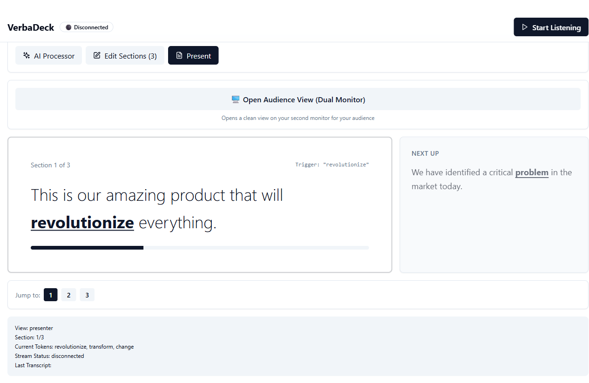
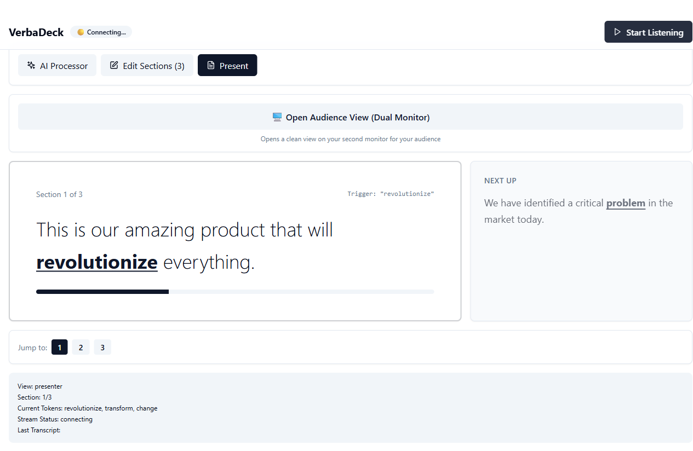
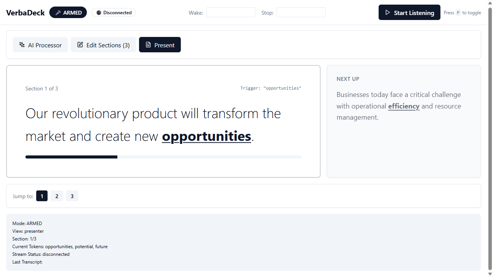

# 🎤 VerbaDeck

**Voice-Driven Presentations with AI-Powered Script Processing**

VerbaDeck is a revolutionary presentation tool that lets you deliver presentations hands-free using voice commands. Speak naturally, and VerbaDeck automatically advances your slides when you say the trigger words. Perfect for demos, speeches, and presentations where you need your hands free.

## 🆕 What's New in v2.0

**Latest Update:** October 31, 2025 - Complete 5-Phase Implementation

- ✅ **Preservation Mode** - Preserve exact wording for enterprise/legal/medical use
- ✅ **Rich Text Editor** - Format with bold, italic, headings, bullets (Tiptap)
- ✅ **Presentation Library** - Save/load to localStorage + file export/import
- ✅ **Progressive Web App** - Install on mobile/tablet, works offline
- ✅ **Video Support** - MP4 playback with voice controls ("play", "pause", "restart")
- ✅ **Live Q&A System** - AI-powered question detection + knowledge base
- ✅ **Mobile Optimized** - Responsive design for any device
- ✅ **Load Test Button** - One-click presentation loading for quick testing

**See:** [EXECUTIVE_SUMMARY.md](EXECUTIVE_SUMMARY.md) for complete before/after comparison



---

## ✨ Features

### 🗣️ Voice Control
- **Voice Navigation**: Say trigger words to advance slides automatically
- **BACK Command**: Navigate to previous slides by saying "back", "previous", or "go back"
- **Real-time Transcription**: Live speech-to-text powered by AssemblyAI
- **Hands-Free**: No clicker, no keyboard - just your voice
- **Video Voice Commands**: Control video playback with "play", "pause", "restart" 🆕

### 🤖 AI-Powered
- **AI Script Processor**: Transform raw text into presentation sections with smart trigger words
- **Preservation Mode**: Checkbox to preserve exact wording (no AI editing) - perfect for legal/medical/sales 🆕
- **Load Test Presentation**: One-click button to load example presentation for quick testing 🆕
- **Multiple AI Models**: Choose from 50+ models (GPT-4, Claude, Gemini, Llama, etc.) via OpenRouter
- **Smart Trigger Detection**: AI suggests natural trigger words based on your content
- **Multi-Trigger Support**: Multiple trigger words per section for flexibility
- **Live Q&A System**: AI-powered question detection and response generation with knowledge base 🆕

### 🎨 Presentation Features
- **Rich Text Editor**: Format text with bold, italic, headings, bullets, and more (Tiptap) 🆕
- **Video Support**: Embed MP4 videos with voice-controlled playback 🆕
- **Image Support**: PowerPoint-style slides with images
- **Dual-Monitor Mode**: Presenter view with controls + clean audience view
- **Trigger Word Carousel**: Visual display of current, next, and previous triggers
- **Live Transcript Bar**: See what's being detected in real-time
- **Section Editing**: Rich editor for content, images, and triggers
- **Progress Tracking**: Visual progress bar and section counter

### 💾 Persistence & Library
- **Save/Load Presentations**: Export to .verbadeck files or load from disk 🆕
- **Presentation Library**: Save presentations to browser localStorage 🆕
- **Auto-Persistence**: Never lose your work
- **Quick Access**: Instantly load previous presentations

### 📱 Mobile & PWA
- **Progressive Web App**: Install on any device (mobile/tablet/desktop) 🆕
- **Offline Mode**: Works without internet after initial load 🆕
- **Responsive Design**: Optimized for portrait and landscape 🆕
- **Mobile-First**: Single presenter view for on-the-go presentations 🆕

### 🎓 Q&A & Knowledge Base
- **Question Detection**: Automatically detects "?" in live transcripts when Q&A mode is ON 🆕
- **Dual-Answer AI**: Generates TWO complete answer options with different perspectives 🆕
- **8 Personality Tones**: Choose how AI answers - Professional, Witty, Insightful, Conversational, Bold, Technical, Storytelling, or Sarcastic 🆕✨
- **"I want you to act as..." Prompting**: Each tone uses persona-based prompts for consistent personality 🆕
- **Knowledge Base Editor**: AI-powered FAQ generation + manual FAQ entry 🆕
- **Context-Aware Answers**: Uses presentation content + knowledge base for accurate responses 🆕
- **Toggle Mode**: "Listen for Questions" button in top bar (appears when listening) 🆕
- **Presenter Display**: Q&A panel below "Next Up" in presenter view for dual-monitor setups 🆕
- **Professional Formatting**: Answers are concise, easy to speak aloud, with bullet points 🆕

**Available Tones**:
- 💼 **Professional**: Clear, direct, credible - confident and authoritative
- ✨ **Witty & Engaging**: Clever wordplay and memorable phrasing
- 🧠 **Deeply Insightful**: Analytical, nuanced, reveals deeper connections
- 💬 **Conversational**: Warm and relatable, no corporate jargon
- 🔥 **Bold & Provocative**: Challenges assumptions, strong statements
- 🔬 **Technical Expert**: Precise, data-driven, metrics-focused
- 📖 **Storytelling**: Compelling narratives with vivid examples
- 😏 **Sarcastic & Sharp**: Dry wit and ironic observations

### 🎯 Presenter Experience
- **Presenter View**: Full controls, trigger words visible, next section preview
- **Audience View**: Clean 50/50 split layout for images and text
- **BroadcastChannel Sync**: Real-time synchronization between windows
- **Smooth Transitions**: Animated slide transitions with framer-motion
- **Section Navigation**: Manual navigation for testing and practice

---

## 🚀 Quick Start

### Prerequisites
- **Node.js** 18+ and npm
- **AssemblyAI API Key**: [Get free API key](https://www.assemblyai.com/) (100 free hours/month)
- **OpenRouter API Key**: [Get API key](https://openrouter.ai/) for AI processing
- **Browser**: Chrome, Edge, or Chromium-based (for Web Audio API)
- **Microphone**: Required for voice input

### Installation

```bash
# Clone the repository
git clone https://github.com/taskmasterpeace/verbadeck.git
cd verbadeck

# Install root dependencies
npm install

# Install server dependencies
cd server
npm install
cd ..

# Install client dependencies
cd client
npm install
cd ..
```

### Configuration

Create a `.env` file in the project root:

```env
AAI_API_KEY=your_assemblyai_api_key_here
OPENROUTER_API_KEY=your_openrouter_api_key_here
```

**🔒 Security**: Never commit your `.env` file. It's already in `.gitignore`.

### Run Development

```bash
# From project root - starts both server and client
npm run dev
```

This launches:
- **Server**: `http://localhost:3001` (WebSocket proxy)
- **Client**: `http://localhost:5173` (Vite dev server)

Open `http://localhost:5173` in your browser and start presenting!

---

## 📖 How to Use

### 1. Process Your Script with AI

1. Click on the **AI Script Processor** tab
2. Choose your preferred AI model (GPT-4, Claude Sonnet, etc.)
3. Paste your raw presentation text
4. Click **"Process with AI"**
5. Wait 30-60 seconds for AI to segment and suggest trigger words

The AI will:
- Split your text into digestible sections
- Suggest natural trigger words for each section
- Provide alternative trigger options
- Format everything for voice navigation

### 2. Edit Sections (Optional)

- Switch to the **Edit Sections** tab
- Click **Edit** on any section to modify content
- Add image URLs for PowerPoint-style slides
- Toggle trigger words on/off
- Reorder or remove sections as needed

### 3. Start Presenting

1. Click **"Start Listening"** (grant microphone permission)
2. Wait for "Connected" status
3. Begin speaking your presentation naturally
4. When you say a trigger word, VerbaDeck automatically advances
5. Say "back" to return to the previous slide
6. Use **"Open Audience View"** for dual-monitor presentations

### 4. Trigger Word Carousel

At the bottom of the screen, you'll see:
- **Left**: "Say back" hint (or previous trigger)
- **Center**: Current section's trigger words (prominently displayed)
- **Right**: Next section's trigger word (preview)

### 5. Dual-Monitor Presenter Mode

1. Click **"Open Audience View"** button
2. A new window opens with the clean audience view
3. Drag the audience window to your second monitor/projector
4. Present from the main window (shows triggers and controls)
5. Audience sees only content and images (no trigger words)

---

## 🏗️ Architecture

### Tech Stack

**Frontend:**
- React 18 + TypeScript
- Vite (build tool)
- Tailwind CSS + shadcn/ui components
- Framer Motion (animations)
- React Router (routing)
- Web Audio API + AudioWorklet
- **Tiptap** (rich text editor) 🆕
- **vite-plugin-pwa** (Progressive Web App) 🆕
- **Workbox** (service worker & caching) 🆕

**Backend:**
- Node.js + Express
- WebSocket proxy for AssemblyAI
- OpenRouter API integration

**APIs:**
- AssemblyAI Universal-Streaming v3 (real-time STT)
- OpenRouter (50+ AI models via unified API)

**Storage:**
- LocalStorage (presentation library) 🆕
- File System (import/export .verbadeck files) 🆕

**Testing:**
- Playwright (E2E and visual regression)

### How It Works

```
┌─────────────────────────────────────────────────────────────┐
│                       User Speaks                           │
└──────────────────┬──────────────────────────────────────────┘
                   │
                   ▼
┌─────────────────────────────────────────────────────────────┐
│  Browser: Web Audio API captures microphone                │
│  AudioWorklet converts Float32 → PCM16 (16kHz mono)        │
└──────────────────┬──────────────────────────────────────────┘
                   │
                   ▼
┌─────────────────────────────────────────────────────────────┐
│  WebSocket → Node.js Proxy (localhost:3001)                │
│  Adds AssemblyAI auth header                                │
└──────────────────┬──────────────────────────────────────────┘
                   │
                   ▼
┌─────────────────────────────────────────────────────────────┐
│  AssemblyAI Real-time STT                                   │
│  Returns transcript events via WebSocket                    │
└──────────────────┬──────────────────────────────────────────┘
                   │
                   ▼
┌─────────────────────────────────────────────────────────────┐
│  React App: Trigger Detection Engine                        │
│  - Checks for BACK commands first                           │
│  - Matches transcript against trigger words (with plurals)  │
│  - Debounces to prevent double-advances                     │
│  - Updates current section index                            │
└──────────────────┬──────────────────────────────────────────┘
                   │
                   ▼
┌─────────────────────────────────────────────────────────────┐
│  BroadcastChannel syncs state to audience view              │
│  Presenter and audience windows stay in sync                │
└─────────────────────────────────────────────────────────────┘
```

---

## 📁 Project Structure

```
verbadeck/
├── client/                      # React frontend
│   ├── src/
│   │   ├── components/
│   │   │   ├── AIScriptProcessor.tsx    # AI script processing UI
│   │   │   ├── AudienceView.tsx         # Clean view for audience
│   │   │   ├── PresenterView.tsx        # Main presenter display
│   │   │   ├── RichSectionEditor.tsx    # Section editing
│   │   │   ├── StatusBar.tsx            # Top navigation
│   │   │   ├── StatusIndicator.tsx      # Listening badge
│   │   │   ├── TranscriptTicker.tsx     # Live transcript bar
│   │   │   ├── TriggerCarousel.tsx      # Trigger word display
│   │   │   ├── TransitionEffects.tsx    # Slide animations
│   │   │   ├── ModelSelector.tsx        # AI model picker
│   │   │   └── ui/                      # shadcn/ui components
│   │   ├── hooks/
│   │   │   ├── useAudioStreaming.ts     # Audio + WebSocket
│   │   │   ├── useOpenRouter.ts         # AI API integration
│   │   │   └── useTransitions.ts        # Animation hooks
│   │   ├── lib/
│   │   │   ├── script-parser.ts         # Token matching logic
│   │   │   ├── openrouter-models.ts     # Model definitions
│   │   │   └── utils.ts                 # Utilities
│   │   ├── pages/
│   │   │   └── AudiencePage.tsx         # /audience route
│   │   ├── App.tsx                      # Main application
│   │   └── main.tsx                     # Entry point
│   ├── public/
│   │   └── audio-processor.js           # AudioWorklet processor
│   └── package.json
├── server/
│   ├── server.js                        # Express + WebSocket proxy
│   ├── openrouter.js                    # OpenRouter API client
│   └── package.json
├── tests/
│   ├── verbadeck.spec.ts               # Main E2E tests
│   └── ai-features.spec.ts             # AI feature tests
├── .env                                 # API keys (gitignored)
├── .gitignore
├── package.json                         # Root workspace
├── playwright.config.ts
└── README.md
```

---

## 🧪 Testing

```bash
# Run all tests
npm test

# Run with UI mode (visual debugging)
npm run test:ui

# Update visual snapshots
npx playwright test --update-snapshots
```

Tests cover:
- ✅ UI rendering and component visibility
- ✅ Voice navigation and section advancement
- ✅ AI script processing
- ✅ Section editing and trigger management
- ✅ Visual regression (screenshot comparisons)
- ✅ Dual-monitor synchronization

---

## 🔧 Development

### Available Scripts

```bash
# Root workspace
npm run dev          # Start both server and client
npm test             # Run Playwright tests
npm run test:ui      # Run tests with UI mode

# Client only
cd client
npm run dev          # Start Vite dev server (port 5173)
npm run build        # Build for production
npm run preview      # Preview production build

# Server only
cd server
npm start            # Start Express server (port 3001)
```

### Environment Variables

**`.env` (root):**
```env
AAI_API_KEY=your_assemblyai_api_key
OPENROUTER_API_KEY=your_openrouter_api_key
```

---

## 🚀 Production Deployment

### Build the Client

```bash
cd client
npm run build
# Output: client/dist/
```

### Deploy Options

**Option 1: Static + Serverless**
- Deploy `client/dist/` to Vercel, Netlify, or Cloudflare Pages
- Deploy `server/` as serverless function or separate Node.js app
- Update WebSocket URL in client to production server

**Option 2: All-in-One**
- Deploy server with static file serving
- Point Express to serve `client/dist/`

**Option 3: Separate Hosts**
- Client on CDN/static host
- Server on Railway, Render, or Heroku
- Update CORS settings for cross-origin WebSocket

### HTTPS Requirement

⚠️ **Required for Production:**
- Microphone access requires HTTPS (except localhost)
- WebSocket should use `wss://` in production
- Use reverse proxy (nginx, Caddy) or platform SSL

### Environment Setup

Set these in your production environment:
```bash
AAI_API_KEY=<your-key>
OPENROUTER_API_KEY=<your-key>
PORT=3001
NODE_ENV=production
```

---

## 🐛 Troubleshooting

### WebSocket Connection Failed
- Check server is running on port 3001
- Verify `.env` file exists with valid API keys
- Check browser console for detailed error

### Microphone Not Working
- Grant microphone permissions in browser
- HTTPS required (except localhost)
- Try different browser (Chrome recommended)

### Trigger Words Not Detected
- Check transcript bar at bottom - is text appearing?
- Verify you're connected (green "Listening" badge)
- Speak clearly and at normal pace
- Check trigger words in carousel match your speech
- Try saying alternative triggers

### AI Processing Fails
- Verify OpenRouter API key is correct
- Check model availability (some require credits)
- Ensure raw text is not empty
- Try a different AI model

### Audience View Not Syncing
- Both windows must be from same origin
- Check BroadcastChannel support in browser
- Try closing and reopening audience view

---

## 🎯 Tips for Best Results

### Script Writing
- **Clear sections**: Separate topics with natural breaks
- **Strong trigger words**: Use distinctive words, not "the", "and", "a"
- **Natural flow**: Write like you speak
- **Image placement**: Add images to key sections for visual impact

### Presenting
- **Test first**: Run through once before the real presentation
- **Speak naturally**: Don't overemphasize trigger words
- **Check venue**: Test Wi-Fi and ambient noise beforehand
- **Have backup**: Keep a clicker or keyboard handy just in case

### AI Model Selection
- **GPT-4 Turbo**: Best overall quality, good speed
- **Claude Sonnet**: Excellent for long scripts, creative triggers
- **Gemini Pro**: Fast, cost-effective for simpler content
- **Llama 3.1 70B**: Free tier available, good for testing

---

## 📸 Screenshots

### Presenter View
Full control interface with trigger words, next section preview, and manual navigation.


### AI Script Processor
Transform raw text into structured presentation sections with smart trigger words.



### Trigger Carousel
See current, next, and previous triggers at a glance.



---

## 🤝 Contributing

Contributions are welcome! Here's how:

1. Fork the repository
2. Create a feature branch (`git checkout -b feature/amazing-feature`)
3. Commit your changes (`git commit -m 'Add amazing feature'`)
4. Push to the branch (`git push origin feature/amazing-feature`)
5. Open a Pull Request

Please ensure:
- Code follows existing style
- Tests pass (`npm test`)
- Add tests for new features
- Update documentation as needed

---

## 📄 License

MIT License - see [LICENSE](LICENSE) file for details

---

## 🙏 Credits & Acknowledgments

Built with amazing open-source tools:

- [AssemblyAI](https://www.assemblyai.com/) - Real-time speech-to-text API
- [OpenRouter](https://openrouter.ai/) - Unified AI model API
- [React](https://react.dev/) - UI framework
- [Vite](https://vitejs.dev/) - Lightning-fast build tool
- [Tailwind CSS](https://tailwindcss.com/) - Utility-first CSS
- [shadcn/ui](https://ui.shadcn.com/) - Beautiful UI components
- [Framer Motion](https://www.framer.com/motion/) - Animation library
- [Playwright](https://playwright.dev/) - Reliable testing framework

---

## 🌟 Star History

If you find VerbaDeck useful, please consider giving it a star ⭐ on GitHub!

---

## 📧 Support

- **Issues**: [GitHub Issues](https://github.com/taskmasterpeace/verbadeck/issues)
- **Discussions**: [GitHub Discussions](https://github.com/taskmasterpeace/verbadeck/discussions)

---

<div align="center">

**Made with ❤️ by the VerbaDeck Team**

**Happy Presenting! 🎤🚀**

</div>
