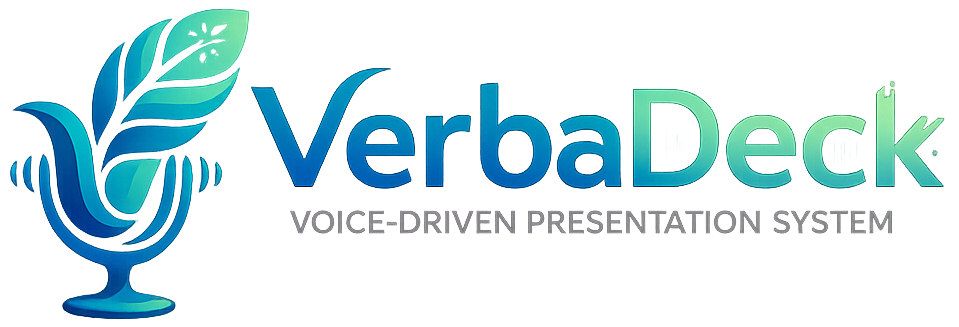
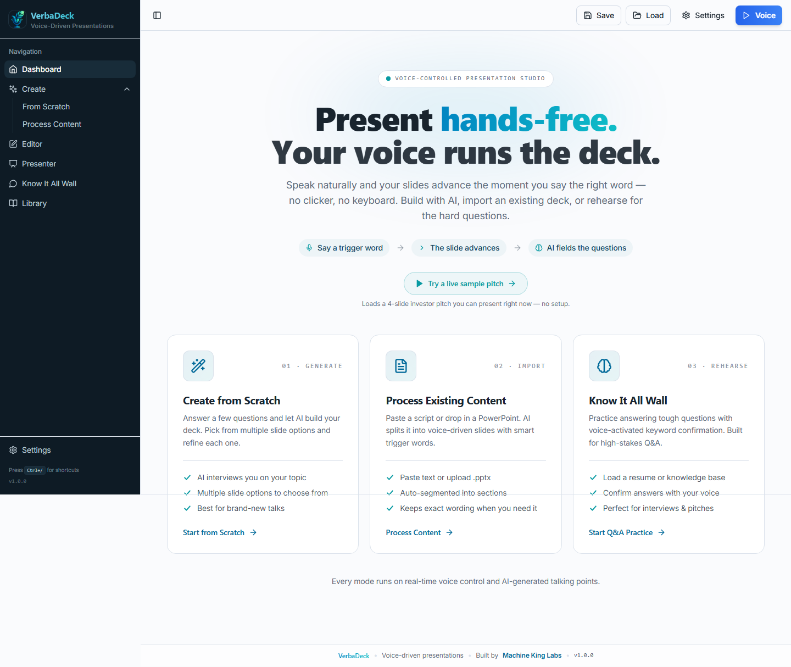
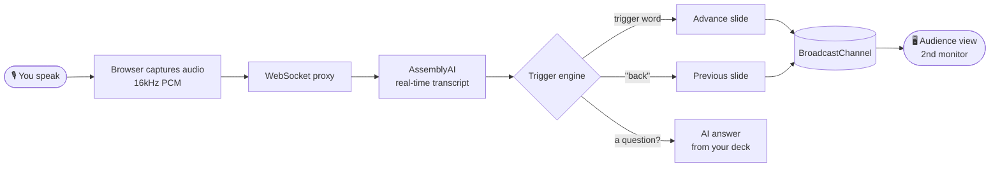
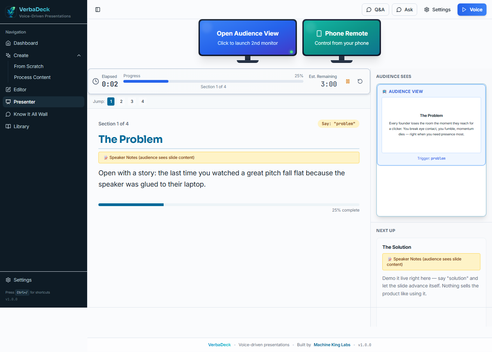
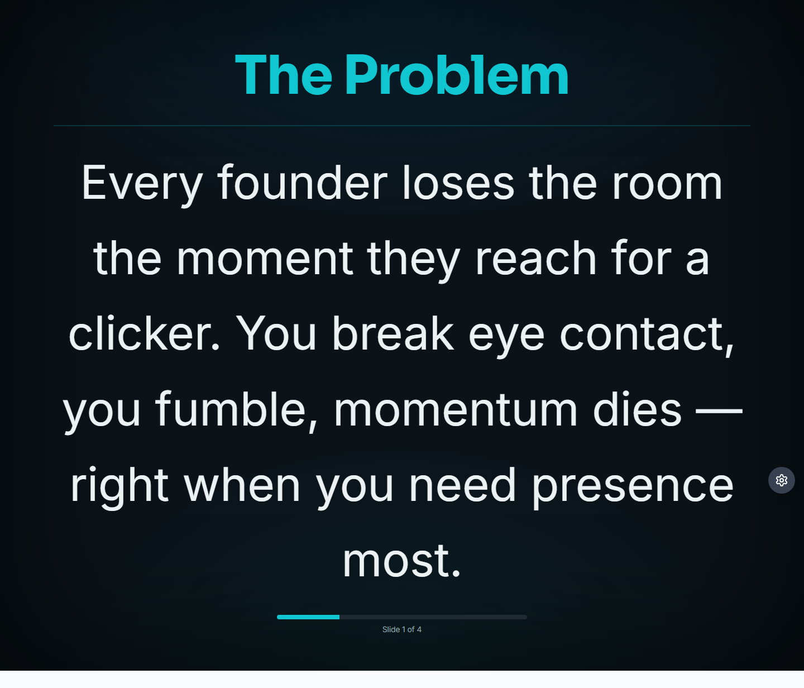

<div align="center">



### Present hands-free. Your voice runs the deck.

Speak naturally and your slides advance the moment you say the right word —
**no clicker, no keyboard, no awkward pauses.** Build decks with AI, import an
existing PowerPoint, and let AI field the hard questions in real time.

[](https://opensource.org/licenses/MIT)
[](https://react.dev/)
[](https://www.typescriptlang.org/)
[](#testing)
[](https://machinekinglabs.com)

**[▶ Landing page](docs/landing/index.html)** · open the file locally, or host `docs/` on GitHub Pages



</div>

---

## Why VerbaDeck

Every presenter loses the room the moment they reach for a clicker. You break eye
contact, you fumble, momentum dies — right when you need presence most. Slide tools
haven't changed that loop in twenty years: the human drives the deck, and the deck
does nothing back.

VerbaDeck flips it. **Your voice is already the controller and the content** — so the
deck follows you. Say a trigger word, the slide advances. Get asked something hard,
AI has the answer ready. Built for the people who present with their hands full and
their reputation on the line: founders pitching VCs, sales engineers demoing live,
speakers on a stage.

## How it works


```mermaid
flowchart LR
    A([🎙️ You speak]) --> B[Browser captures audio<br/>16kHz PCM]
    B --> C[WebSocket proxy]
    C --> D[AssemblyAI<br/>real-time transcript]
    D --> E{Trigger engine}
    E -->|trigger word| F[Advance slide]
    E -->|&quot;back&quot;| G[Previous slide]
    E -->|a question?| H[AI answer<br/>from your deck]
    F --> I[(BroadcastChannel)]
    G --> I
    I --> J([🖥️ Audience view<br/>2nd monitor])
```

A 2-second debounce prevents accidental double-advances, trigger words match plurals
automatically (`solution` → `solutions`), and `"back"` always wins over a forward
trigger. Manual arrow-key navigation works alongside voice, so a missed word never
strands you.

## Three ways to build

|  | Mode | What it does |
|--|------|--------------|
| 🪄 | **Create from Scratch** | AI interviews you, then generates slide options you curate into a deck. |
| 📄 | **Process Existing Content** | Paste a script or drop a `.pptx` — AI splits it into voice-driven slides with trigger words. |
| 🧠 | **Know It All Wall** | Load a resume or knowledge base and rehearse Q&A with voice-confirmed answers. |

<div align="center">


<br/>
<em>Presenter cockpit (left): live timer, trigger cues, audience preview, and what's next. Audience view (right): clean, on a second monitor — synced over BroadcastChannel.</em>
</div>

## Feature highlights

**Live delivery**
- 🎙️ Voice-controlled advancement — multi-trigger, plural-aware, with a `"back"` command
- ⏱️ Countdown buffer — the audience advances instantly while you finish your sentence
- 🖥️ Dual-monitor sync — clean audience view + a presenter cockpit, in perfect sync
- 📱 Phone remote — drive the deck from your phone via QR code
- 🔮 Live Q&A — questions are detected and answered from your slides, in 8 tones

**AI prep**
- ✨ Speaker-note transforms — Expand / Simplify / Analogy / Story
- 🎨 One-click image recommendations from millions of free stock photos
- 🤔 Q&A anticipation — the questions you'll be asked, with answers written before you start
- 🧩 50+ models via OpenRouter, cost-optimized per operation (fast & cheap where it can be, premium where it matters)

**Power-user**
- ⌨️ Keyboard shortcuts (press `Ctrl + /`)
- 🧪 Agent-native bridge — `window.__verbadeck` drives the whole deck programmatically (see [below](#agent-native--testable))
- 💾 Local-first — presentations never leave your machine; export/import as `.verbadeck`

> **Try it in 5 seconds:** click **"Try a live sample pitch"** on the home screen to load a
> 4-slide investor pitch and jump straight into the presenter.

## Quick start

```bash
git clone https://github.com/taskmasterpeace/verbadeck.git
cd verbadeck
npm install

# add your keys
cp .env.example .env   # then fill in the values below

npm run dev            # client → http://localhost:5175 · server → http://localhost:3002
```

```env
AAI_API_KEY=your_assemblyai_key          # real-time speech-to-text
OPENROUTER_API_KEY=your_openrouter_key   # AI generation & Q&A
PEXELS_API_KEY=your_pexels_key           # image recommendations (instant approval)
REPLICATE_API_KEY=your_replicate_key     # optional: AI image generation
```

All four providers have free tiers. Microphone access needs `https://` in production
(localhost is fine for development).

## Agent-native & testable

Anything a presenter can do by speaking, an agent or a test can do programmatically.
Run with `?testMode=true` and a bridge appears on `window`:

```js
window.__verbadeck.loadDemo();              // load the sample pitch → presenter
window.__verbadeck.say('the solution');     // speak — drives the real trigger pipeline
window.__verbadeck.back();                  // previous slide
window.__verbadeck.enableQA(true);
window.__verbadeck.say('what is your traction?');  // detected as a question
window.__verbadeck.getState();              // { currentSectionIndex, sectionCount, ... }
```

This is the same `handleTranscript` path live audio uses — so the [E2E tests](tests/core-promise.spec.ts)
verify the core promise without a microphone.

## Architecture

```
client/   React 18 + TypeScript + Vite · Zustand · Tailwind + shadcn/ui · Framer Motion · Tiptap
server/   Express + ws · WebSocket proxy to AssemblyAI · OpenRouter & Replicate clients
tests/    Playwright E2E + Vitest unit tests
```

- **Audio:** Web Audio API → AudioWorklet (Float32 → PCM16, 16kHz) → WebSocket
- **State:** Zustand stores (`usePresentationStore`, `useVoiceStore`, …); only user settings persist
- **Sync:** `BroadcastChannel('verbadeck-presentation')` keeps presenter ↔ audience aligned
- **Models:** per-operation defaults in `server/model-config.js` (cheap models for background tasks, premium for quality)

See [CLAUDE.md](CLAUDE.md) for a deep architectural reference.

## Testing

```bash
npm test                                   # full Playwright suite
npx playwright test tests/core-promise.spec.ts --project=chromium   # core promise (6 tests)
cd client && npm run test:unit             # Vitest unit tests (59 tests)
```

- **59 unit tests** cover trigger matching, debounce, back-priority, and storage migration.
- **6 E2E tests** drive the real app via the testMode bridge to prove hands-free nav + Q&A detection.

## Roadmap

Shipped today: everything above. Next up — **Rehearsal Mode** (AI coaching on pace and
filler words), real-time trigger suggestions while editing, and live multi-language
audience translation.

## License

MIT — see [LICENSE](LICENSE). Built by [Machine King Labs](https://machinekinglabs.com).

<div align="center"><sub>If VerbaDeck helps you command the room, consider leaving a ⭐.</sub></div>
